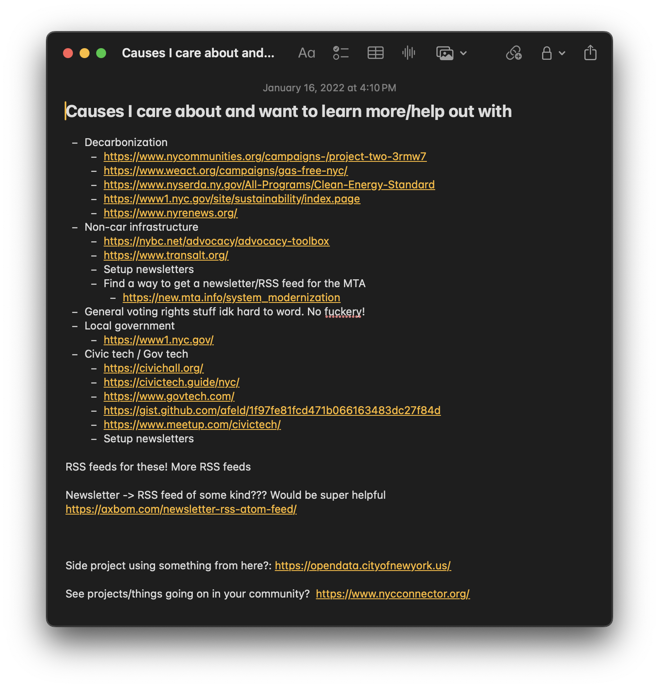

A few friends asked me how I got to be more politically engaged in our city, so I figured I'd write a bit about my journey so I could have something to point them to. Hopefully this is helpful.

## Why get involved locally?

I used to follow national politics intensely, listening to multiple national politics podcasts weekly and at some level priding myself on knowing about a vote in a state I’ve never been to. I thought this was what it meant to be politically active. It felt like watching my favorite sports team. I could celebrate with them when they won and be sad with them when they lost. At a certain point dread started to creep in, knowing that those wins and losses were real and affected me. I mistook myself knowing the names of the plays, the stats of every player, and the season’s schedule as playing the game. The small power I knew I had was to say that I was informed enough to choose the best option presented in front of me, but it felt as if that didn't mean much in the grand scheme. I realized I wasn’t actually in the game. It was entertainment cosplaying as action. What can I actually do? The big power I lacked was the ability to shape the options presented to me, and I think that big power is rooted in organizing and collective action.

Where this approach took me was to focus more within the context of city and state level politics. I live in a city and state that is more aligned with my political views than not, and thus it felt like something I could have a direct line of cause and effect when it comes to policies, elected officials, my lived experience, and what I can do to influence it. This is the basis of my journey and what I’ll reference. However, the important takeaway from this isn’t that local politics are more important than national politics. It is to see what you can do to help out **from where you are** to get the politics you want.

## Where do I start?

It is hard to be plugged into everything all the time, so I'd recommend listing a few causes that you care about. A few years ago I made such a list. The list does not have to be long! The important takeaway here is to reframe politics as something that is done, rather than something that just happens.

From there, I googled each one of these topics and added "NYC groups" to the end of it. You may find large groups or small groups, but all of them will have their contact information or a newsletter to get you plugged in with low commitment. Every one of these groups is waiting for the opportunity to be heard by someone. Look around their website, see how active they are, when they meet, and see if they have a local chapter near you in order to gauge if this is a group that you think is right for you. This is the first step to actually playing; you’re making your way down from the stands.

This is what my original list ended up looking like:

This was a good starting point! Reading my list back now, I see a few forks in the road that could have led me down paths that ultimately keep me operating within that “small power.” For example, many of the bullet points I wrote were about where I could find more information. This could have led to replicating my national politics dread if it wasn’t balanced out by potential actions I could take like going to a meetup. Another seductive fork in the road is my individualism of trying to brainstorm ideas about something cool to make, and seeing that as _the_ way to make an impact. I might have been able to make something cool, but I’d argue it’s unlikely that my ideas would have **single handedly** won me the things I claimed to want; maybe what I was really seeking was feeling like I _personally_ did something good. This can be a trap, similar to thinking the only way to help your sports team win is by scoring on your own. Many people do end up making really cool things for the right reasons with their talent, just as there are many players who can score a lot of points. Collective action is not saying that everyone must score, it’s that everyone should help the team win.

I think in this pursuit, we should first look to plug into groups and join efforts where they exist that are doing the work we want to be done. Together you will have a much better chance of making an impact!

## Show up

The next thing to do is to show up to a meeting or action that the group is taking. I don’t think it matters much whether it’s in person or on Zoom, the important thing is that you are taking the step from wanting to be involved to being involved. You are now on the court. Something to remember is that most of these groups are eager to have new members to be able to better advocate and fight for the things they believe in. You are not expected to have answers or come in with a solution. You are not expected to score. Approach joining these groups with the question “how can I help?”

Then keep showing up!
